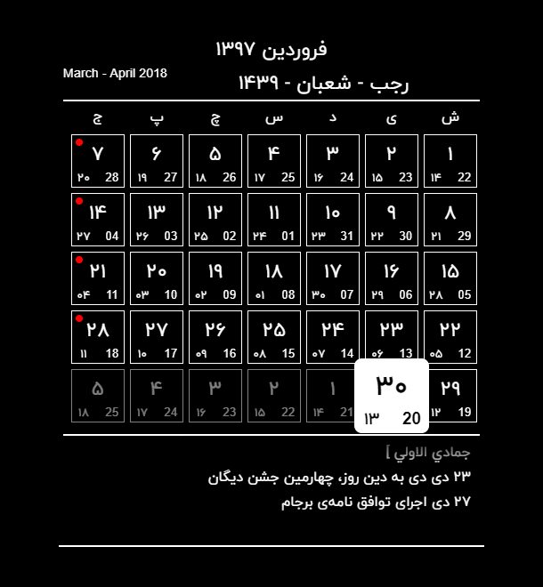

[](https://github.com/prettier/prettier)
# Jalali, Qamari, Miladi Calendar from "time.ir" Offline JSON API
Web Crawler for Time.ir to Obtain JSON File, Jalali, Qamari, Miladi JSON Calendar API.
## Demo

>This project is part of [Magic Mirror](https://github.com/HosseinMarzban/MagicMirror) Calendar Module.


<br>

## Description
This piece of code work as an offline way, it means that I saved the page that years I want in `calc` folder, then I crawl into that file and parse and export as a JSON file. [Find and Manipulate your Target Date.](https://www.time.ir/fa/eventyear-%D8%AA%D9%82%D9%88%DB%8C%D9%85-%D8%B3%D8%A7%D9%84%DB%8C%D8%A7%D9%86%D9%87)

## JSON OUTPUT
``` json
{
    "version": "1.0.0",
    "creatAt": "2018/3/21",
    "cal": {
        "1397": {
            "jalali": "فروردین 1397",
            "miladi": "March - April 2018",
            "qamari": "رجب - شعبان - 1439",
            "event": [
                [
                    {
                        "isHoliday": true,
                        "text": "\"1 فروردین\\nجشن نوروز/جشن سال نو\""
                    },
                    {
                        "isHoliday": false,
                        "text": "\"1 فروردین\\nشهادت امام علی النقی الهادی علیه السلام\\n [ 3 رجب ]\""
                    },
                    .
                    .
                    .
                ],
                .
                .
                .
            ],
            "days": [
                 [
                    {
                        "holiday": false,
                        "disabled": true,
                        "days": {
                            "j": "26",
                            "m": "17",
                            "q": "28"
                        }
                    },
                    {
                        "holiday": false,
                        "disabled": true,
                        "days": {
                            "j": "27",
                            "m": "18",
                            "q": "29"
                        }
                    },
                    .
                    .
                    .
                 ],
                 .
                 .
                 .
            ]
        },
        "1398": { ... },
        "1399": { ... }, ...
    }
}
```

## Develop and Contribute

1. install dependecy `npm i`
2. build JSON API `npm run build`
